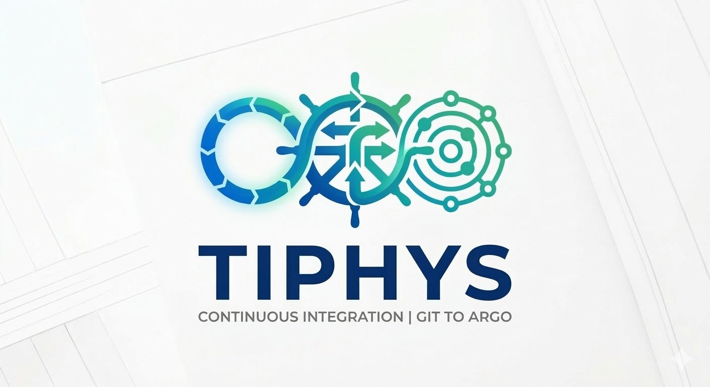

# tiphys



A Go service that listens for GitHub webhook events and automatically runs CI pipelines on [Argo Workflows](https://argoproj.github.io/argo-workflows/). Developers define their pipeline in a simple `.tiphys.yaml` file in their repo — no Argo Workflow YAML required.

## How It Works

```
GitHub Push / PR / Tag Event
        │
        ▼
 tiphys webhook service
  ├── 1. Validates HMAC-SHA256 signature
  ├── 2. Fetches .tiphys.yaml from the repo at the exact commit SHA
  ├── 3. Checks if the event matches the trigger rules (branch, action, tag pattern)
  ├── 4. Compiles the pipeline config into an Argo Workflow
  └── 5. Submits the Workflow to Argo Workflows
        │
        ▼
   Argo Workflows (Kubernetes)
```

## Project Structure

```
├── cmd/server/               # Main entrypoint
├── internal/
│   ├── config/               # Environment-based configuration
│   ├── webhook/              # HTTP handler + GitHub payload types
│   ├── github/               # GitHub API client (fetch pipeline files)
│   ├── argo/                 # Argo Workflows client (submit workflows)
│   └── tiphys/               # Core pipeline engine
│       ├── schema.go         # .tiphys.yaml struct definitions
│       ├── loader.go         # Fetch + parse + validate .tiphys.yaml
│       ├── trigger.go        # Event matching logic
│       ├── compiler.go       # Translate PipelineConfig → Argo Workflow
│       └── steps/
│           ├── registry.go   # Step type registry
│           ├── go.go         # go/test, go/build
│           └── docker.go     # docker/build-push
├── deploy/k8s/               # Kubernetes manifests
├── examples/.tiphys.yaml     # Annotated example pipeline config
├── Dockerfile
└── Makefile
```

## Prerequisites

- Go 1.22+
- A Kubernetes cluster with [Argo Workflows](https://argoproj.github.io/argo-workflows/installation/) installed
- A GitHub Personal Access Token with `repo` (read) scope
- A publicly reachable URL for the webhook endpoint

## Getting Started

### 1. Configure environment variables

```bash
cp .env.example .env
# Edit .env with your values
```

| Variable                   | Required | Default    | Description                                              |
|----------------------------|----------|------------|----------------------------------------------------------|
| `GITHUB_TOKEN`             | ✅       | —          | GitHub PAT with `repo` read access                       |
| `WEBHOOK_SECRET`           | ✅       | —          | Secret set in the GitHub webhook configuration           |
| `PORT`                     |          | `8080`     | HTTP server port                                         |
| `ARGO_NAMESPACE`           |          | `argo`     | Kubernetes namespace to submit workflows into            |
| `WORKFLOW_SERVICE_ACCOUNT` |          | `workflow` | Service account the workflow Pods run as                 |
| `ALLOWED_REPOS`            |          | (all)      | Comma-separated `org/repo` allowlist; empty = allow all  |
| `LOG_LEVEL`                |          | `info`     | `debug`, `info`, `warn`, `error`                         |
| `KUBECONFIG`               |          | (in-cluster) | Path to kubeconfig for local dev                       |

### 2. Add `.tiphys.yaml` to your repo

Create a `.tiphys.yaml` in the root of any repository you want to run CI for.

```yaml
version: "1"

on:
  push:
    branches: ["main", "develop"]
  pull_request:
    branches: ["main"]
  tag:
    pattern: "v*"

pipeline:
  image: golang:1.22-alpine

  steps:
    - name: test
      uses: go/test
      with:
        packages: "./..."
        race: "true"

    - name: build
      uses: go/build
      with:
        output: bin/app

    - name: docker-push
      uses: docker/build-push
      with:
        image: myregistry/myapp
        tag: "{{commit}}"
        registry_secret: docker-registry-credentials
      dependsOn: [build]
```

See `examples/.tiphys.yaml` for a fully annotated version covering all options including both secret strategies.

### 3. Build and run locally

```bash
go mod tidy
export $(grep -v '^#' .env | xargs)
make run
```

### 4. Deploy to Kubernetes

```bash
# 1. Create secrets
kubectl create secret generic webhook-secrets \
  --from-literal=github-token=<PAT> \
  --from-literal=webhook-secret=<WEBHOOK_SECRET> \
  -n tiphys

# 2. Update deploy/k8s/deployment.yaml with your image and domain

# 3. Build and push your image
make docker-build docker-push IMAGE_NAME=yourregistry/tiphys

# 4. Apply manifests
make deploy
```

### 5. Configure the GitHub Webhook

1. Go to your repo → **Settings → Webhooks → Add webhook**
2. **Payload URL**: `https://your-domain.com/webhook`
3. **Content type**: `application/json`
4. **Secret**: the value of `WEBHOOK_SECRET`
5. **Events**: select **Push** and **Pull requests** (or "Send me everything")

---

## Pipeline Configuration Reference

### Trigger Rules (`on`)

```yaml
on:
  push:
    branches: ["main", "feature/*"]   # glob patterns for branch names
    ignore: ["release/*"]             # branches to never trigger on
  pull_request:
    branches: ["main"]                # target (base) branch patterns
    actions: [opened, synchronize]    # default: opened, reopened, synchronize
  tag:
    pattern: "v*"                     # glob pattern for tag names
```

### Pipeline Steps (`pipeline.steps`)

Each step runs sequentially by default. Use `dependsOn` to build a custom DAG.

```yaml
pipeline:
  image: golang:1.22-alpine    # default image for all steps
  env:                         # global env vars injected into every step
    - name: CGO_ENABLED
      value: "0"

  steps:
    - name: my-step
      uses: go/test            # built-in step type (see below)
      image: golang:1.23       # override the pipeline-level image
      with:                    # step-type-specific options
        packages: "./..."
      env:                     # step-scoped env vars
        - name: GOFLAGS
          value: "-mod=readonly"
      secrets:                 # secret values injected as env vars
        - name: MY_SECRET
          source:
            k8sSecret:
              secretName: my-k8s-secret
              key: the-key
      dependsOn: [other-step]  # explicit DAG dependency
```

### Built-in Step Types

#### `go/test`

Runs `go test` inside the cloned repo.

| `with` key    | Default  | Description                         |
|---------------|----------|-------------------------------------|
| `packages`    | `./...`  | Package pattern                     |
| `race`        | `true`   | Enable the race detector            |
| `count`       | `1`      | Test count flag                     |
| `extra_args`  | —        | Raw extra args appended to the command |

#### `go/build`

Compiles a Go binary.

| `with` key    | Default    | Description                          |
|---------------|------------|--------------------------------------|
| `output`      | `bin/app`  | Output binary path                   |
| `ldflags`     | `-w -s`    | Linker flags                         |
| `main`        | `./...`    | Main package path                    |
| `extra_args`  | —          | Raw extra args                       |

#### `docker/build-push`

Builds and pushes a Docker image using [Kaniko](https://github.com/GoogleContainerTools/kaniko) (no Docker daemon required).

| `with` key         | Default              | Description                                           |
|--------------------|----------------------|-------------------------------------------------------|
| `image`            | **required**         | Destination image name (e.g. `myregistry/myapp`)      |
| `tag`              | commit SHA           | Image tag                                             |
| `dockerfile`       | `Dockerfile`         | Path to Dockerfile relative to repo root              |
| `context`          | `.`                  | Build context path relative to repo root              |
| `cache`            | `true`               | Enable Kaniko layer caching                           |
| `cache_ttl`        | `24h`                | Layer cache TTL                                       |
| `registry_secret`  | —                    | K8s Secret name containing `.dockerconfigjson`        |
| `extra_args`       | —                    | Raw extra flags passed to Kaniko                      |

### Runtime Variables

The following variables are available in `with` values via `{{variable}}` interpolation:

| Variable      | Description                          |
|---------------|--------------------------------------|
| `{{commit}}`  | Full commit SHA                      |
| `{{branch}}`  | Short branch name (e.g. `main`)      |
| `{{tag}}`     | Tag name for tag events              |
| `{{repo}}`    | Full repo name (e.g. `org/repo`)     |

### Secrets

tiphys supports two strategies for injecting secrets into step containers:

**Strategy A — Kubernetes Secret (recommended for production)**

The value is resolved at Pod runtime via a Kubernetes `valueFrom` reference. The secret value is never stored in the Workflow object.

```yaml
secrets:
  - name: DOCKER_PASSWORD
    source:
      k8sSecret:
        secretName: registry-creds   # Kubernetes Secret name
        key: password                # key within the Secret's data map
```

**Strategy B — Webhook service environment variable**

The value is read from the tiphys webhook Pod's own environment at compile time and baked into the Workflow as a plain string. Suitable for non-sensitive config or locked-down clusters where the Workflow object in etcd is not a concern.

```yaml
secrets:
  - name: DOCKER_PASSWORD
    source:
      env:
        varName: REGISTRY_PASSWORD   # env var set on the tiphys Deployment
```

---

## Endpoints

| Method | Path       | Description              |
|--------|-----------|--------------------------|
| `POST` | `/webhook` | GitHub webhook receiver  |
| `GET`  | `/healthz` | Liveness probe           |
| `GET`  | `/readyz`  | Readiness probe          |

## Development

```bash
make test    # run all tests
make lint    # run golangci-lint
make tidy    # tidy go modules
make build   # compile binary to bin/webhook-server
```

## Security

- All incoming requests are validated against the HMAC-SHA256 signature from GitHub (`X-Hub-Signature-256`).
- Restrict which repos can trigger pipelines using `ALLOWED_REPOS`.
- The service runs as a non-root user (`65534`) in the Docker image.
- Kubernetes deployment sets `readOnlyRootFilesystem` and drops all capabilities.
- For registry credentials, prefer the `k8sSecret` source — values are never stored in the Workflow object.

## License

MIT
